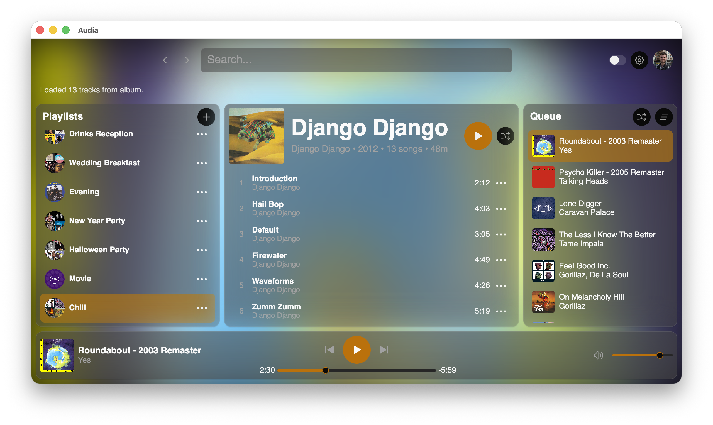

# Audia

Audia is a desktop Spotify client written in Rust, built with [Vizia](https://github.com/vizia/vizia) for the UI and [librespot](https://github.com/librespot-org/librespot) for local playback.


> Spotify Premium is required.

> This project is still in early development and is likely to contain bugs and rough edges.



## Highlights

- Rust-native desktop app with a custom Vizia interface
- Spotify OAuth login flow with persisted credentials
- Search across tracks, artists, and albums
- Playlist browsing and track filtering
- Create, rename, and delete playlists
- Add and remove tracks in playlists
- Local playback controls (play, pause, seek, volume)
- Queue and recently played side panel
- Automatic token refresh for long-running sessions
- Persistent UI and playback preferences

## Quick Start

### 1. Prerequisites

- Rust toolchain (stable)
- Spotify Premium account

### 2. Platform Build Requirements

Audia depends on `vizia`/`skia-safe` for UI rendering and `librespot` (`rodio`/`cpal`) for audio playback, so you need a few OS-native build tools and libraries.

#### Linux (Debian/Ubuntu)

Install compiler and native development libraries:

```bash
sudo apt update
sudo apt install -y \
	build-essential \
	pkg-config \
	libasound2-dev \
	libx11-dev \
	libxrandr-dev \
	libxi-dev \
	libxcursor-dev \
	libxinerama-dev \
	libwayland-dev \
	libxkbcommon-dev
```

#### macOS

No special setup is required beyond installing Rust. The necessary native libraries are included with macOS.

#### Windows

Install:

- Visual Studio Build Tools (Desktop development with C++)

### 3. Create a Spotify Developer App (Client ID)

1. Open the [Spotify Developer Dashboard](https://developer.spotify.com/dashboard) and sign in with your Spotify account.
2. Click **Create app**.
3. Enter an app name and description, agree to Spotify's terms, then submit.
4. Open your new app in the dashboard and go to its settings/details page.
5. Find **Client ID** and copy it to your clipboard.

Keep this Client ID available for Audia's Spotify login setup when prompted.

### 4. Build & Run

```bash
cargo run --release
```

On first launch, use the login dialog to authenticate with Spotify.

## Current Status

Audia is actively evolving. Core flows (login, browsing, search, playback, queue, and playlist operations) are in place, but the app is not yet production-ready.

If you hit a bug, opening an issue with steps to reproduce is very helpful.

## License

See [LICENSE](LICENSE).

