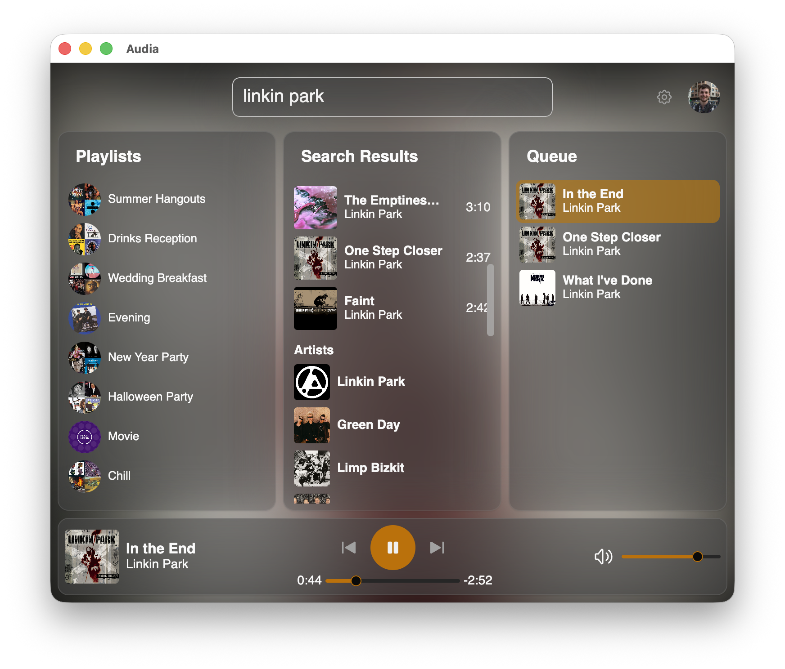

# Audia

A Spotify client written in Rust using the [Vizia](https://github.com/vizia/vizia) GUI library and [librespot](https://github.com/librespot-org/librespot).

> WARNING: This project is still in early development. Expect lots of bugs.

## Features

- [x] Spotify OAuth login
- [x] User profile retrieval (display name + avatar)
- [x] Spotify search (tracks, artists, and albums)
- [x] Playlists panel
- [x] Queue panel
- [x] Local playback

## Building

With Rust installed use `cargo build` to build an executable.

